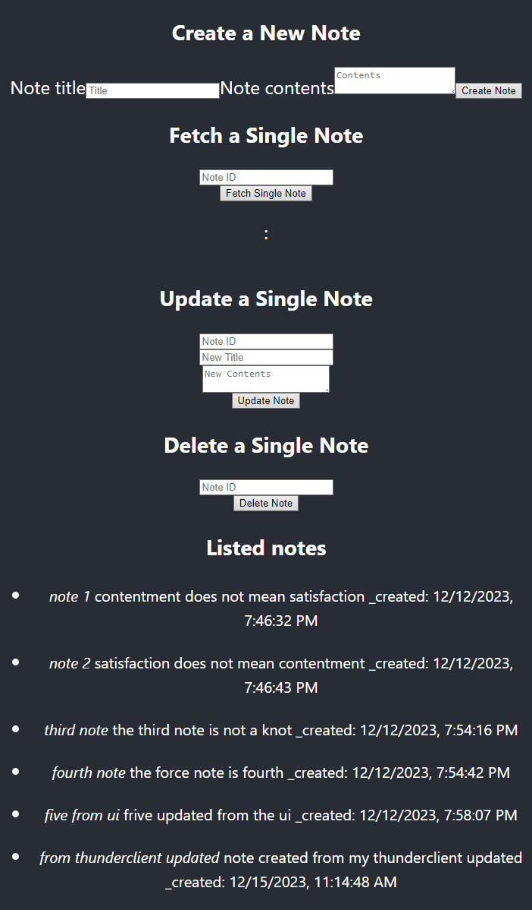

# ExpresSQLReact

This is what it currently looks like:

## What's working:

- backend API: MySQL database connection using mysql2
- middleware/router using express
- clientside ui using React
- Create, Read, Update, Delete endpoints all working from UI to backend

## What's not working:

- no bootstrap, just used the default React template page

## How to use:

1. download the project
2. setup .env variables for the server
   MYSQL_HOST=usually_localhost
   MYSQL_DATABASE=
   MYSQL_USER=
   MYSQL_PASSWORD=
   MYSQL_T_NOTES=name_of_table_in_db
   EXPRESS_PORT=8080
3. setup .env for the client
   REACT_APP_URL='http://localhost'
4. install dependencies for server by running `npm i` inside the server folder.
5. install dependencies for client by running `npm i` inside the client folder.
6. open terminal 1 and run `npm run dev` in the server folder
7. open terminal 2 and run `npm start` in the client folder
